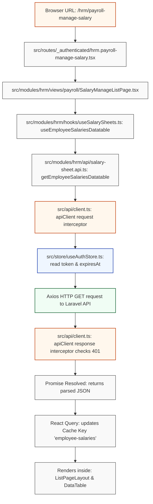
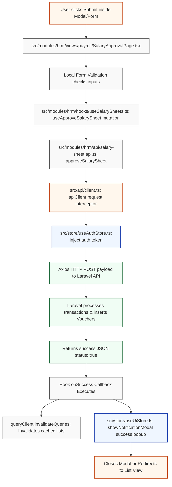

# ERP Frontend Process Flow & File Trace

This document maps the exact file execution paths and state propagation for both the **Data Loading** and **Form Submission** processes.

---

## 1. Data Loading Process Flow

This flow describes how data is requested, authenticated, and rendered when a user opens a page.

### Mermaid Flowchart



### Detailed File-by-File Trace

1. **Browser Trigger**: The user enters `/hrm/payroll-manage-salary` or clicks the page link.
2. **Router Match** (`src/routes/_authenticated/hrm.payroll-manage-salary.tsx`):
   * Mounts the `SalaryManageListPage` component from the HRM module.
3. **View Init** (`src/modules/hrm/views/payroll/SalaryManageListPage.tsx`):
   * Sets up local page states (pagination `currentPage`, filters `selectedMonth`, search `searchQuery`).
   * Calls the query hook: `useEmployeeSalariesDatatable(queryFilters)`.
4. **Hook Query** (`src/modules/hrm/hooks/useSalarySheets.ts`):
   * Wraps the query in React Query `useQuery` using queryKey `['employee-salaries', filters]`.
   * Triggers the API execution function `getEmployeeSalariesDatatable(filters)`.
5. **API Client Calling** (`src/modules/hrm/api/salary-sheet.api.ts`):
   * Calls `apiClient.get('/hrm/employee/employee-salary/datatable', { params: filters })`.
6. **Request Interceptor** (`src/api/client.ts`):
   * Intercepts the outbound request.
   * Reads from `useAuthStore.getState()` (Zustand store in `src/store/useAuthStore.ts`).
   * Appends the Bearer token (`Authorization: Bearer <token>`) to headers.
7. **Laravel Endpoint**: Laravel returns the paginated data.
8. **Response Interceptor** (`src/api/client.ts`):
   * Receives response. If a `401 Unauthorized` error occurs, triggers `clearUser()` to clean session keys and logs the user out.
9. **State Resolution**: React Query stores results in the cache, toggles `isLoading` to `false`, and returns the `data` array back to the `SalaryManageListPage` component.
10. **Render**: The view component feeds the array to the `<DataTable>` component to display rows to the browser.

---

## 2. Form Submission Process Flow

This flow describes what happens when a user fills a form and submits it to post dynamic changes to the database.

### Mermaid Flowchart



### Detailed File-by-File Trace

1. **User Submission**: The user clicks **"Approve & Post"** inside the modal on [`SalaryApprovalPage.tsx`](file:///D:/laragon/www/erp_new/erp_frontend/src/modules/hrm/views/payroll/SalaryApprovalPage.tsx).
2. **Form Validation**:
   * Inspects variables in local state. If validations check out, it invokes the mutation: `mutate(approveDto)`.
3. **Mutation Hook** (`src/modules/hrm/hooks/useSalarySheets.ts`):
   * Sets `isPending` state to `true` (which disables buttons and renders loading states).
   * Runs the async function `approveSalarySheet(dto)`.
4. **API Service Call** (`src/modules/hrm/api/salary-sheet.api.ts`):
   * Sends the payload to Axios client: `apiClient.post('/hrm/salary-sheet/approve', dto)`.
5. **Request Header Injection** (`src/api/client.ts`):
   * The interceptor retrieves the active token from Zustand (`useAuthStore`) and appends it as `Authorization: Bearer <token>`.
6. **Backend Transaction**:
   * Laravel executes the controller actions, inserts journal entries inside the database, and returns a success response.
7. **Mutation Lifecycle Resolution** (`src/modules/hrm/hooks/useSalarySheets.ts`):
   * On HTTP code `200/201`, the `onSuccess` block of the mutation executes:
     ```typescript
     onSuccess: () => {
       queryClient.invalidateQueries({ queryKey: salarySheetKeys.all() })
     }
     ```
   * Clears the cache for all query keys starting with `salarySheetKeys.all()`, forcing list pages to reload details in the background.
8. **UI Alert Trigger** (`src/store/useUiStore.ts`):
   * Dispatches the success dialog popup via Zustand: `useUiStore.getState().showNotificationModal(...)`.
9. **UI Action**:
   * Closes the active mapping modal, resets input forms, and redirects the browser back to the payment list.
